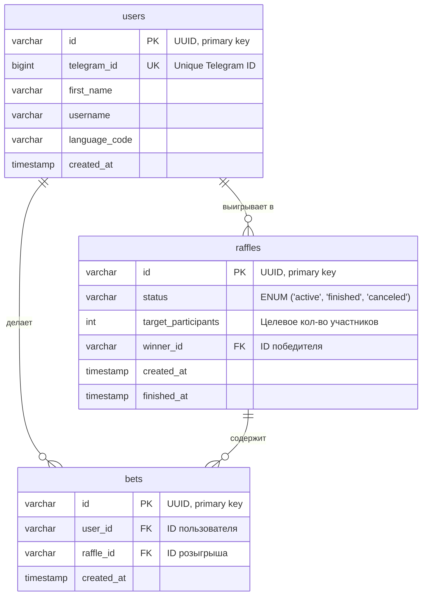

# Схема Базы Данных

Этот документ описывает структуру таблиц в базе данных PostgreSQL и связи между ними.

## Диаграмма (ERD)

## Описание таблиц

### `users`
Хранит информацию о пользователях, которые взаимодействовали с приложением.

*   `id` (PK): Уникальный внутренний идентификатор пользователя (UUID).
*   `telegram_id` (UK): Уникальный идентификатор пользователя из Telegram. Используется для связи и уведомлений.
*   `first_name`, `username`, `language_code`: Данные, полученные от Telegram.
*   `created_at`: Дата и время регистрации.

### `raffles`
Хранит информацию о каждом розыгрыше.

*   `id` (PK): Уникальный идентификатор розыгрыша (UUID).
*   `status`: Текущий статус розыгрыша (`active` - идет набор, `finished` - завершен, `canceled` - отменен).
*   `target_participants`: Количество участников, необходимое для запуска розыгрыша.
*   `winner_id` (FK): Ссылка на `users.id` победителя. Заполняется после завершения.
*   `created_at`, `finished_at`: Временные метки.

### `bets`
Хранит информацию о каждой сделанной ставке. Связующая таблица между `users` и `raffles`.

*   `id` (PK): Уникальный идентификатор ставки (UUID).
*   `user_id` (FK): Ссылка на `users.id` пользователя, сделавшего ставку.
*   `raffle_id` (FK): Ссылка на `raffles.id` розыгрыша, в котором сделана ставка.
*   `created_at`: Время совершения ставки.